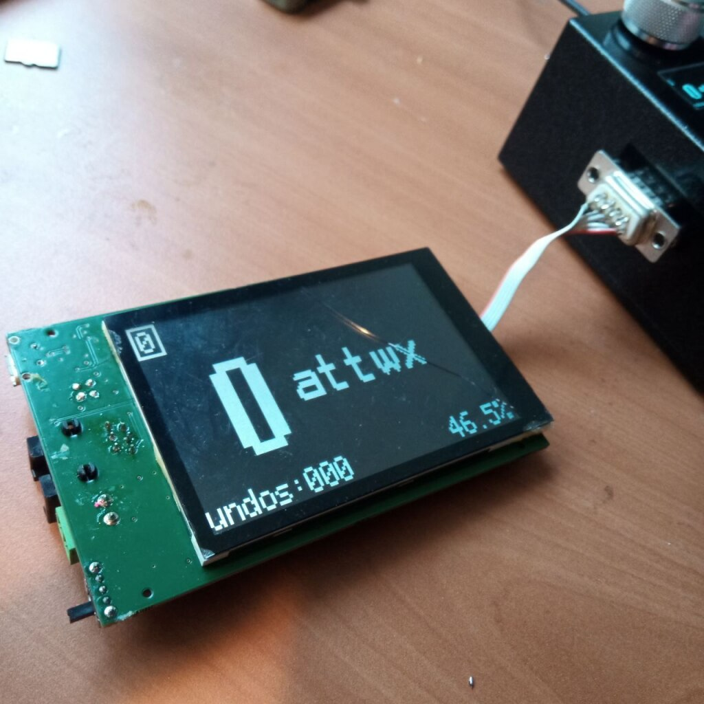
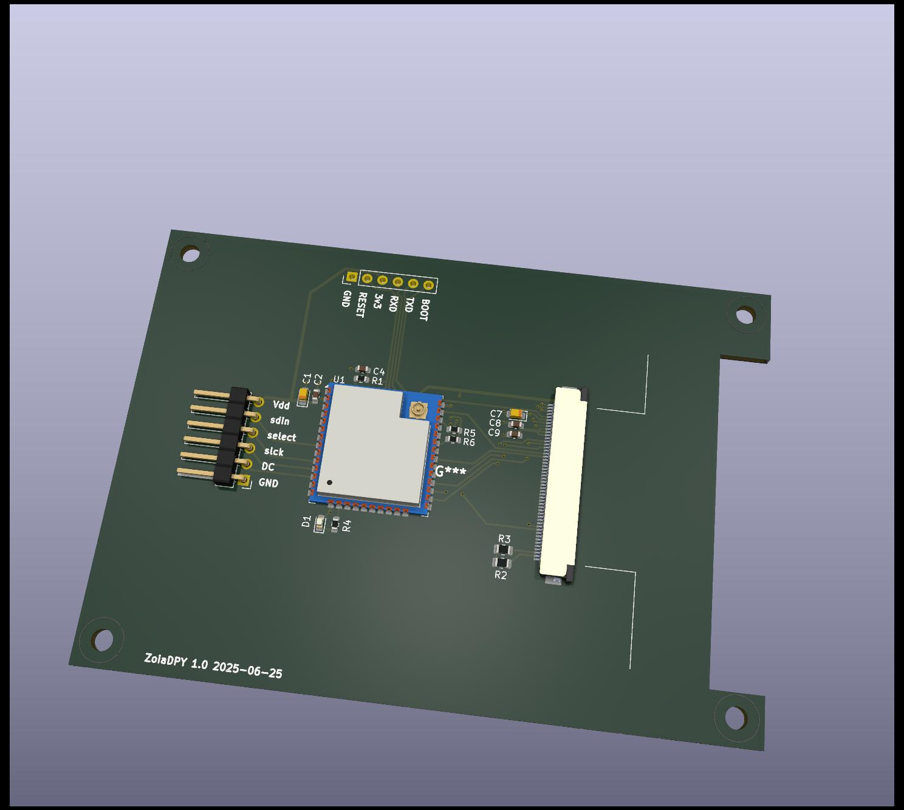

# Experimental external display for the Empress Zoia

The repo holds the source code and schematics/pcb design for an external
display for the Zoia. The Zoia comes with a screen so small you can cover it
with the tip of your pinky. This is barely usable when prgramming the Zoia on
your couch, but totally useless on stage when changing programs or parameters.

This external display hooks onto the SPI bus between the Zoia en the tiny OLED
display and sniffs the screen contents when the display is updated. The screen
is upscaled to 480x320 resolution and sent to a second larger display.

The Zoia luckily exposes the OLED SPI on a friendly 2.54mm header row, so
anyone with basic soldering skills should be able to connect some wires to
these and feed them out of the box. I used a retro style DB9 type connector
for this myself, as this happened to be available in my parts drawer. You
need 5 wires in total, so any connector with enough pins should do:

- GND
- VCC
- MOSI
- CLK
- CS

# Disclaimer

I love this little project for me personally, but I do not recommend others to
go hack their Zoia: you will surely void the warranty of your box, and it is
very possible it will break in the process of adding the screen. Do not
complain to me when this happens.

# Software

Not too complicated: ESP32 has a bunch of SPI busses and supports both master
and slave mode. The OLED SPI is running in slave mode and handles all SPI
transfers of exactly 1024 bytes, as these contain the full updated screen data.
All other SPI transfers are simply ignored, as these contain the usual setup
parameters for the display.

The second SPI runs in master mode and drives an ILI4822 type TFT display which
I happened to have lying around. Although this is a full color display, it's
driven in 3 bits per pixel mode only to allow the big screen to keep up with
the OLED frame rate.

# Hardware

Kicad schematics and PCB design are available, but I have not yet produced this
as I'm happy to run on my current prototype hardware. I'm sure these are mostly
ok but someone will have to actually build and test these to make sure. I might
do this one day.

